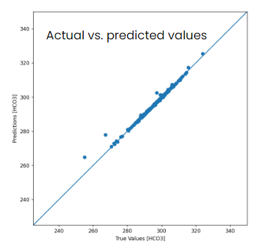

*July 11 - August 7, 2022*

[Co-designer Introduction](https://renaww.github.io/bwsi-assistive-tech-hydration-pouch/#my-co-designer)
[Problem Selection: Dehydration](https://renaww.github.io/bwsi-assistive-tech-hydration-pouch/#problem-selection-dehydration)

During the summer of 2022, I was selected to be part of Beaverworks Summer Institute (BWSI), an engineering summer program for high school students hosted by MIT's Lincoln Laboratory. Specifically, I was part of the assistive technology (AT) course, where each of us picked a **co-designer** to design an assistive technology with.

> **CO-DESIGNER:** the end users we worked with to desgin a product for. Their input was especially important throughout the build process, and after each iteration we would go to them for testing and feedback. In that sense, they were more like another designer, hence the name **co-designer**.

Over the course of 4 weeks, we attended lectures, participated in exercises, and learned about the design process as well as what it takes to make assistive technology in the real world. At the culmination of the program, we'd each developed our own piece of AT to make an impact on a real user. The entire creation of my product has been documented below.

# My Co-designer

During this course, I worked with my cousin. She is a minimum data set (MDS) and floor nurse at an assisted living home, managing a floor of 12-14 patients in critical condition, and recently received a  PhD in nursing with research focusing on dementia/alzheimer's care. In my initial interview, I asked her about her own challenges at work, as well as challenges she has obseerved in her residents' daily living. Boiled down, she identified multiple issues and/or potential solutions which have been listed below:

##### Regarding residents
- CULTURAL CLASH: With residents from many different cultural backgrounds, many residents don't enjoy the activities they are currently presented with, which they've never been introduced to until arriving at the nursing home. Especially in those with dementia this clash is more striking, since they tend to enjoy and remember only things from when they were young, base upon original culture.
- CULTURAL BRIDGING: To help with these residents' missing cultural connections, my co-designer suggested a way to bridge these residents with younger generations of the same culture, giving the elderly a form of social connection but also giving the younger generations a mentor in life.
- MEMORY TRACING: While residents with memory loss may not fully comprehend the current situation, part of their memories still reacts to "pleasant events"--memories from earlier in life. Thus, these "pleasant events" are often a good way to stimulate the memories of residents with dementia. Assembling these pictures and memories into one interactive "photobook", accompanied with narration from relatives, may be a way to use tech and help make finding "plesant events" easier.
- TECHNOLOGY GAP: Especially with the rise of tech after COVID, many seniors are finding it harder to connect with others. For example, many of their social events still use telephone as video chat, while more effective in providing connection, is too hard for most residents to use without external assistance.
-  TRANSPORTATION: Without drivers' licenses, getting to and from in-person social events has also been a major issue. Even when residents have arranged public transportation, they are bound to schedules that are not as flexible as they like.
- MEDICATION MANAGEMENT: Many older adults actually move to nursing homes because they are taking a lot of medications, so having a more streamlined solution for this would help them live much more independently.
- ASSISTIVE TECH COST: Many current assistive technologies like dentures and hearing aids are extremely easy to lose. At the same time however, they are very expensive to replace. So, my co-designer brought up the idea of using rapid manufacturing techniques to create these technologies for cheaper, while still maintaining their personalization.

##### Regarding caretakers
- COVID CONTACT TRACING: Currently, if a patient becomes COVID-positive, the patient has to list all their contacts and the nursing home contact-traces that way. However, if there was a way to track the residents' COVID exposure automatically, this would be a huge imporvement on behalf of the nursing home facilitators.
- VACCINATION TRACKING: Due to COVID the vaccination requirements at my co-designer's nursing home have become much stricter. With multiple steps and stages that need to be logged. However there is no efficient system to do so--currently everything is being tracked with an Excel sheet, which cannot handle data from all the residents and employees. So, a more efficient tracking method would be greatly beneficial to smoother hospital administration.
- PRESSURE ULCERS: Since many residents are bed-ridden, they tend to develop pressure ulcers. To prevent these, caretakers currently have to reposition the patient every 2 hours, which adds lots of extra time to the caretakers' schedules. If there was a way to automate this, for example a bed that could reposition itself, this would not only ensure residents get timely repositioning, but also take a load of stress of the caretakers.
- INFECTION TRACKING: Nursing home managers often have to track cross-contamination. If one person gets a disease, nurses will measure what bacteria, tract...etc and watch if anyone else gets the same tract nearby, in which case there is a high probability of contamination. However, currently much of this is up to human judgement and my co-designer mentioned it would be greatly helpful if a computer could help more accurately detect and notify of cross-contamination
- ELECTRONIC MEDICAL RECORDS: The point click care software used for nursing home management was something my co-designer also reflected could be more efficient. Currently, the computers are also mounted on stationary carts, so when administering medication, nurses often have to rush between the room and cart, which greatly reduces the efficiency of their work.

##### Affecting both parties
- HYDRATION: On the patient side, many residents affected by memory loss forget to drink water. Coupled with a weakening sense of thirstiness, residents can often become dehydrated without realizing--in fact my co-designer mentioned numerous cases of patients who came in and simply needed to rehydrate. On the healthcare worker side, she brought up the fact that many of her co-workers and her went entire shifts without drinking water--it was simply too inconvenient, and being faced with an immensly busy schedule time would pass in an instant.

# Problem Selection: Dehydration
After reviewing everything my co-designer brought up, I eventually settled on the final problem: dehydration. Different from all the other issues she'd mentioned, dehydration had impact on both patients and the workers taking care of them. My co-designer told a story of an elderly woman that came into the nursing home, sleepy every day and literally needing to be pinched to wake up. After talking with a doctor however, the issue was simply dehydration--after receiving some IV fluids, she was like a whole other person. In fact, after more research, cases like this were far more common than they appeared to be.

> 37% of older people admitted to the emergency department were dehydrated, and, of these, 62% were still dehydrated 48 hours after admission (El-Sharkawy et al, 2014)

My co-designer also described her personal struggle with remembering to keep hydrated: working night shifts and managing an entire wing, each patient has a strict schedule they need to follow. She begins the shift with wound care and updating patient statuses, before rushing to check diabetic patients' insulin levels and administering their dosage at the exact time during dinner. After another round of nighttime medications, only then does she begin writing patient documentation. This entire process ends well into the night, at around 11pm and with so many moving parts she simply forgets to drink water--even while knowing the negative effects of doing so. Furthermore, with the PPE required, and water bottle being in a separate room from their main station, it is simply inconvenient to get water, also contributing to the caretaker dehydration issue.

So, given that dehydration has become prevalent in both parties: the caretaker and patient, I had an idea:
***How could I leverage technology to create a solution that reminds <ins>both</ins> caretakers and patients to stay hydrated?***

With that, I set out to develop a single solution that could solve a problem for both parties...

# User Needs and Requirements
Taking my co-designer's description of the problem, I developed a set of user needs, which I then finalized into concrete requirements, as listed in the table below:

| User Needs                                          | Product Requirements                                              |
| --------------------------------------------------- | ----------------------------------------------------------------- |
| Passive dehydration tracking                        | Continuously monitors dehydration and alerts when water is needed |
| Low cost                                            | Use only the parts that are necessary                             |
| Easy to incorporate into preexisting daily routines | Minimal size and bulkiness                                        |
| No interference with daily activities               | Wearable or easy to carry around, minimal amount of manual input  |
| Low maintenance                                     | Minimal setup and charging required                               |
| Usable for everyone                                 | WCAG compliant display, streamlined UI                            |
| Intuitive operation                                 | Minimal features, Understandable UI                               |

# Idea Generation
When speaking about dehydration in the initial interview, my co-designer had mentioned that a way to detect dehydration and remind the user of it would be extremely helpful. So, I began digging into what sort of hydration detection-and-reminding solutions were out there already, and evaluated them based on the two key factors for hydration sensing that my co-designer identified: accuracy and usability. Essentially, the proposed solution needed to provide a fairly accurate reading (considering its potential usage in a medical setting) while also being usable--easy to carry around, not likely to waste additional time using, and simple enough for elderly residents to use on their own. With these considerations, I created the competitor matrix shown below:

On the bottom left were solutions that were neither usable nor accurate: things like the skin pinch test and hydration app (requiring users to manually input everything). Smartwatches were also placed in this category, as they were not continuously monitoring dehydration or simply were not market-validated. On the much more accurate side was blood tests, however these were even less usable as they required the user to get a blood test and wait for results every time they wanted to measure dehydration. 

Conversely, on the bottom right was the smart water bottle--a much more usable solution that could be easily incorporated into the user's daily life. However, since these bottles are bulky and not very portable, and the user cannot have a water bottle on them at all times, there are also significant drawbacks in terms of usability. Furthermore, these are not very accurate, as these bottles are essentially just a timer or simply assume the user drinks from the same water bottle. Finally, there are the two best solutions: small, portable hydration sensor. One option I looked into used MRI technology, however it was still far too bulky to be a passive dehydration monitor and also was not technologically developed enough for commercial usage. The other option was a wearable biosensor. While these fulfilled much of the product requirements, there were again significant drawbacks: the sensing patches were single-usage, making them expensive and inconvenient to keep on replacing. Additionally, the app interface the sensor connects to was much more complex, with tables and graphs and data that elderly residents would likely not be able to comprehend--or need.

#### *Essentially, the proposed to device would aim to passively detect and notify when users are at risk of dehydration, while being easily accesible for all user groups*

# Idea #1
My co-designer currently wears an iwatch, and the device needed to be as minimally intrusive as possible so my first thought was to create some sort of watch-based device. Specifically, using measurable vital signs to find a correlation with dehydration and providing notifications that way.

*The sketch of my initial idea*

But first, I needed to see if dehydration could even be accurately predicted with basic vital signs. So, I set out to create a model that could correlate vital signs like heart rate and pulse oximetry with osmolality--a blood indicator, which Thomas, David R., et al. (2008) found to be suggestive of impending dehydration if between 295-300. Using Beth Israel Deaconess Medical Center's MIMIC III database of 51 clinical variables from 46,520 patients, I was able to filter the set for 4 vital signs that on-the-market sensors are able to detect: heart rate, respiration rate, temperature, and pulse oximetry. The set also contained blood urea nitrogen (BUN), plasma glucose, blood sodium, and blood potassium, from which osmolality was calculated.

*Formula for blood osmolality, Thomas, David R., et al. (2008)*

Then using tensorflow, I began to construct multi-input models to predict osmolality from the 4 input variables. First, I tried a standard multi-input linear regression--however this produced too much error (in fact too much that it did not show when graphed). So, I constructed a deep neural network instead, and this time, as shown in the comparison images below, the results were much more favorable. When graphed, the error for each epoch (pass through training data) showed a steady decrease until it was near 0 around the 100th epoch for the deep neural network model (right side), whereas the error for linear regression, on the left, was still over 10 (outside of the graph). 

Furthermore, looking at mean absolute error (the sum of absolute errors divided by sample size) it was even more clear that the deep neural network (DNN) was more effective. 

|                      | Mean absolute error [Osmolality] |
| -------------------- | -------------------------------- |
| Linear model         | 68.286270                        |
| Neural network model | 0.365076                         |

  <!--<article class="markdown-body"><table>
<thead>
<tr>
<th>User Needs</th>
<th>Product Requirements</th>
</tr>
</thead>
<tbody><tr>
<td>Passive dehydration tracking</td>
<td>Continuously monitors dehydration and alerts when water is needed</td>
</tr>
<tr>
<td>Low cost</td>
<td>Use only the parts that are necessary</td>
</tr>
<tr>
<td>Easy to incorporate into preexisting daily routines</td>
<td>Minimal size and bulkiness</td>
</tr>
<tr>
<td>No interference with daily activities</td>
<td>Wearable or easy to carry around, minimal amount of manual input</td>
</tr>
<tr>
<td>Low maintenance</td>
<td>Minimal setup and charging required</td>
</tr>
<tr>
<td>Usable for everyone</td>
<td>WCAG compliant display, streamlined UI</td>
</tr>
<tr>
<td>Intuitive operation</td>
<td>Minimal features, Understandable UI</td>
</tr>
</tbody></table>
</article>-->

In fact, when I ran through the test dataset and plotted the actual vs. predicted values on this DNN model, it was extremely accurate--so in short, yes, at least with this dataset these vital signs and osmolality did have a high correlation...
###### Note: in the image below the predictions and true values should be for [Osmolality], not [HCO3]--it has been wrongly captioned

# However, there were major issues...
***On the technical side:***
While there was a strong *correlation* between the vital signs and osmolality, there was really no causation between the two: there was very little scientific backing behind these variables, and when I attempted to graph the individual variables vs osmolality, points were completely scattered as well. Thus, especially with usage in a medical setting, it would not be trustworthy and the model was guesswork at best. Furthermore, the dataset I used was measured with professional medical equipment with the most accurate methods (ie. measuring heart rate on the heart), whereas to build this device, I would have to use on-the-market electronic sensors that would be far less accurate than medical equipment, especially considering that everything would have to be measured from the wrist. 
***On the human usage side:***
When reviewing this idea, I realized that my co-designer also currently owns an iwatch. Considering that the device could also have a much broader usage base--including other healthcare workers or anyone who needs a hydration reminder--it would be counterintuitive to build a whole other watch for the sole purpose of hydration, and there is really no point in wearing a second watch.      